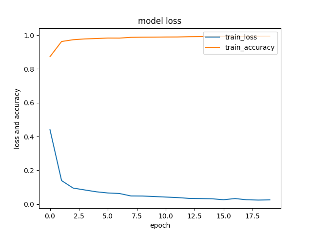
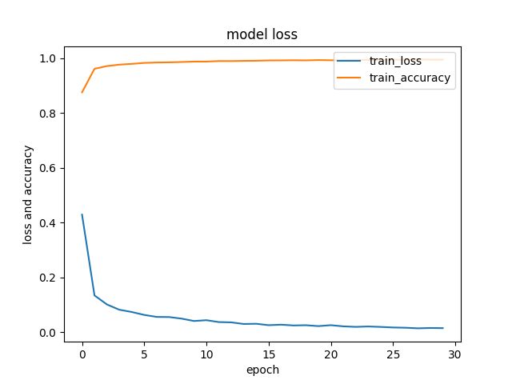
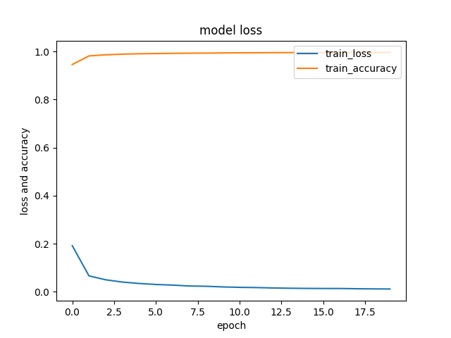
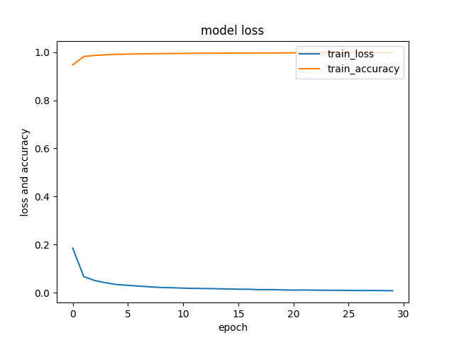

# Detection image de chiffre manuscrit

Executé le init.py au clonage du repo

<table>
    <thead>
        <tr>
            <th colspan="2">Truc à faire</th>
        </tr>
    </thead>
    <tbody>
        <tr>
            <td>Refaire l'ihm</td>
            <td>Nolan</td>
            <td>En cours</td>
        </tr>
        <tr>
            <td>Sauvegarder les tableau numpy en fichier cache pour faire l'entrainement plus vite une fois tout chargé</td>
            <td>Clément</td>
            <td>Fait</td>
        </tr>
        <tr>
            <td>Decaler les image a gauche a droite en haut en bas</td>
            <td>Clément</td>
            <td>Fait</td>
        </tr>
        <tr>
            <td>Re entrainé ensuite</td>
            <td>Clément</td>
            <td>En cours</td>
        </tr>
    </tbody>
</table>

<table>
    <thead>
        <tr>
            <th colspan="5">Statistique</th>
        </tr>
        <tr>
            <th>Source</th>
            <th>Accuracy 20 epochs</th>
            <th>Image 20 epochs</th>
            <th>Accuracy 30 epochs</th>
            <th>Image 30 epochs</th>
        </tr>
    </thead>
    <tbody>
        <tr>
            <td>Set de base: 41 979 images</td>
            <td>99.22 %</td>
            <td></th>
            <td>99.09 %</td>
            <td></th>
        </tr>
        <tr>
            <td>Image decalle: 209 895 images</td>
            <td>99.77 %</td>
            <td></th>
            <td>99.85 %</td>
            <td></th>
        </tr>
    </tbody>
</table>